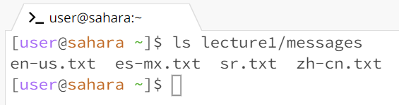
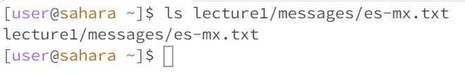
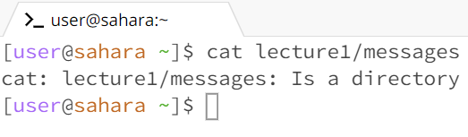
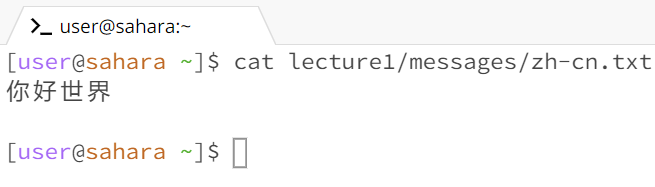

Brandon Panuco  
LAB 1

 
CD # 1: 
Before running the command, the working directory is /home. cd by itself does not change the directory path since the path is already situated at the home directory. Only way it could make a change is if I had the directory path set to a different directory other than the home directory. For example, directory path changes from /home/lecture1/messages to /home by inputting cd with no arguments. So, Working directory after running the command is /home as well. The output does not produce any errors.

CD # 2:
Before running the command, the working directory is /home. cd with an argument changes the directory path to the specified folder from the last part of the path argument. In this case I specified a path change from the home directory to the lecture1 directory. If I had specified: cd /home/lecture1/messages, then the last part of the path argument, in this case messages, would be the new path directory. So, Working directory after running the command is /home/lecture1/messages. The output produces no errors. 

CD # 3:
Before running the command, the working directory is /home. cd with a file, in this case a txt file, as an argument produces an error. The reason why it produces an error is simply because of the purpose of the command cd, which is to change path directories and not to change the path into a file. /home remains as the working directory due to the error.  

LS # 1:
Before running the command, the working directory is /home. ls by itself will list the files and folders in the current path. In this case ls by itself in the home directory lists the only folder available in /home, lecture1. So, our working directory remains /home since there is no change to the path. This produces no error since /home is a valid path for ls.  

LS # 2:
Before running the command, the working directory is /home. ls with a directory path as an argument will list the contents found inside the provided path. In this case I wanted to know the contents of messages folder, so ls listed the files found inside messages, which were all txt files. So, our working directory is /home/lecture1/messages after I cd into /messages path. No errors were produced by the output since /messages is a valid path.   

LS # 3:
Before running the command, the working directory is /home. ls with a file as an argument will basically provide me with the file's path. This is not an error since files can only store the contents of the file itself and not numerous files like directories are able to hold. Hence, when asking to list the directory of a file you are provided the file's path instead. In this case after running the command, the working directory has no change as it remains as /home.  

CAT # 1:
Working directory before running the command is /home. Providing the terminal with the cat command with no argument seems to result in an infinite loop where the terminal waits for keyboard input until a termination is requested. If I typed anything on the terminal it would have been returned back into the terminal as output. I terminated the loop by pressing ctr + c on keyboard. This is no error, as in linux inputting cat with no arguments waits for keyboard input. Working directory remains /home.  

CAT # 2:
Working directory before running the command is /home. When using a directory as an argument,in this case messages directory, on the cat command I was presented with the message letting me know that the given directory path is a directory. I feel like this is an error in which the terminal lets its user know that the user provided a non file path. This makes sense since cat is suppose to work for files only. The working directory remains as /home after running the command.  

CAT # 3:
Working directory before running the command is /home. Using cat with a file path as its argument displays the contents found inside that specific file. In this case I chose to access the zh-cn.txt file, which displayed everything that was typed inside that file. This is clearly no error as it correcly outputs the contents inside the specified path. Working directory does not change and stays as /home.  

