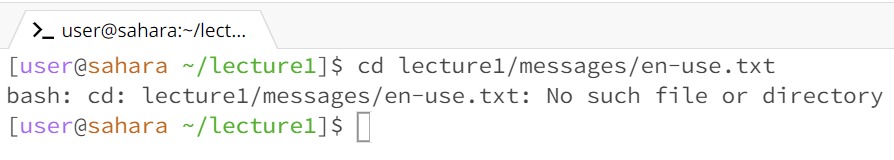

LAB 1

CD # 1: 
cd by itself does not change the directory path since the path is already situated at the root directory. Only way it could make a change is if I had the directory path set to a different directory other than the root directory. For example, directory path changes from lecture1/messages to the root by inputting cd with no arguments. 

CD # 2:
cd with an argument changes the directory path to the specified folder from the last part of the path argument. In this case I specified a path change from the root directory to the lecture1 directory. If I had specified: cd lecture1/messages, then the last part of the path argument, in this case messages, would be the new path directory.

CD # 3:
cd with a file, in this case a txt file, as an argument produces an error. The reason why it produces an error is simply because of the purpose of the command cd, which is to change path directories and not to change the path into a file.

