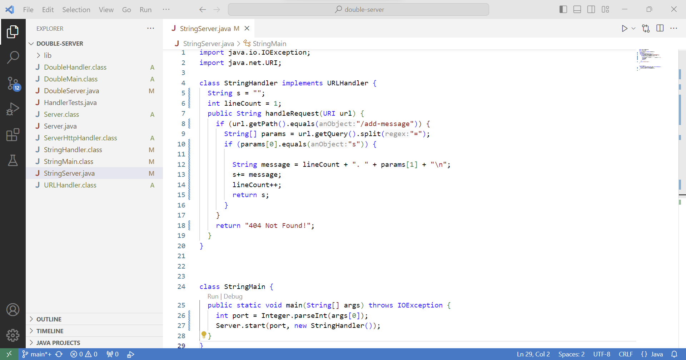
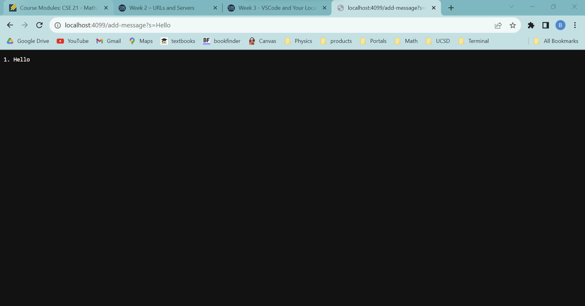
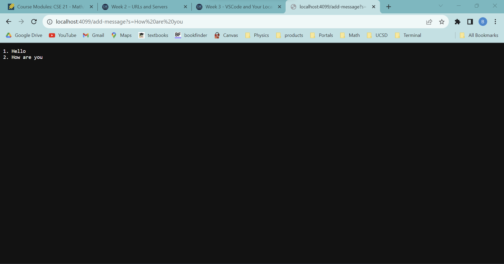
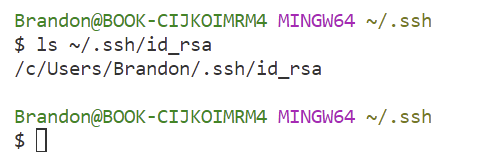
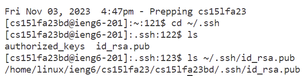
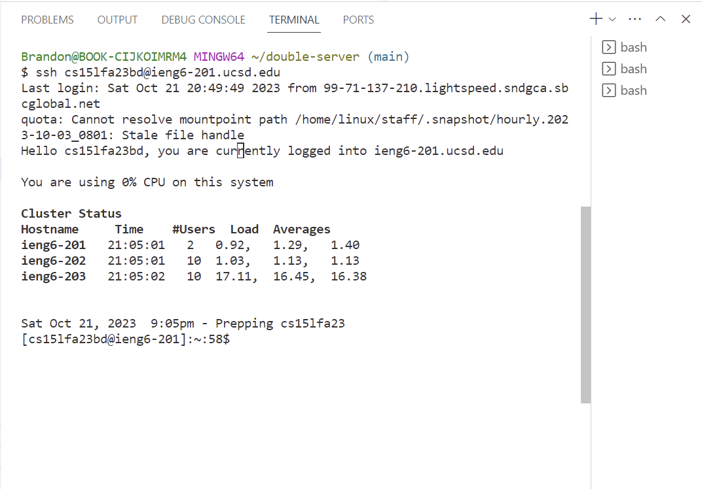

Brandon Panuco 
Lab 2 

Part 1 

The following image displays the code used to create the StringServer. My code creates a java file named StringServer with inner class StringHandler that implements 
URLHandler and StringMain. Code inside StringHandler is where the path and behavior occurs. StringMain is where the server starts and the port is provided according
to the user's choice. 
 

Line 1 

First to start server I ran commands: javac Server.java StringServer.java , and then java StringMain <Port>. In order to get a single line with the words "Hello" as 
output, I added /add-message?s=Hello to the end of the url. StringMain takes care of starting the server where an instance of StringHandler is envoked and where handleRequest
runs with an URL(includes port) as an argument. StringHandler has global variables String s = "" and int lineCount = 1. Variable s is the output displayed in our window, while 
lineCount takes care of adding numbers to each new line created when user changes their request in url. So once handleRequest method is envoked, if it does not have a path, 
then error message is displayed. If we request a message, in this case Hello, the message will be displayed with a new line ready in case user changes the request, so that request 
gets added below. First we need to make sure the request path is correct by invoking getPath() method: url.getPath().equals("/add-message"). Then if valid path, the split method 
will create a string array named params that holds s and our desired message. message variable will make sure to combine the current line number, whole message, and set a new line.
By then s will get updated by adding the message string into it and the lineCount will increase by 1. Laslty, s is returned and displayed into the server output. Overall, 
variables s and lineCount only get updated, while message and params reset for each request. 

 

Line 2  
Now if we refresh the website by either updating or not updating the message request, a new message will be displayed below the old messages with their specific numbered lines.
In the image below I chose to update my request from "Hello" to "How are you" and after reloading the website, "How are you" was displayed below the older message "Hello". The
same steps occured as Line 1, except that variables s and lineCount keep the previous data, while message and params change in relation to the new request. Once the request is 
handled by handleRequest method, variables s and lineCount get updated where s gets added the message and lineCount increases by 1. The process will repeat for any new request 
handleRequest receives.

 

Part 2 
 
 
 

Part 3  

In weeks 2 and 3 I learned to connect remotely from my laptop with by student account. I had experience connecting to a server locally, but never understood how to connect remotely
and be able to run and compile code. I also learned how to used new commands such as cd, ls, cat, pwd, and scp. One of the most important things that I learned is having to set up
visual studio code and add the java extension to it. I feel very satisified with the new concepts that I am learning so far.
