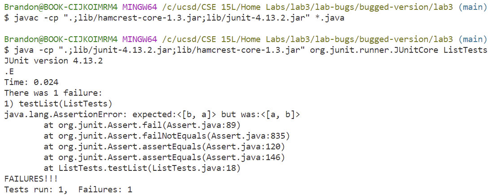
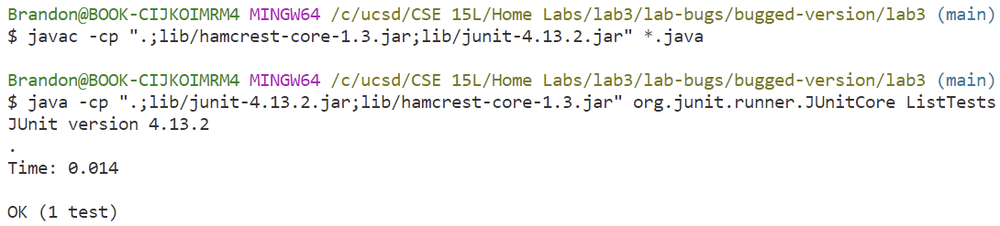
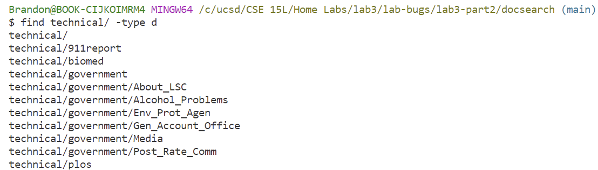
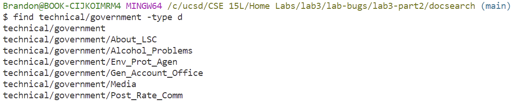
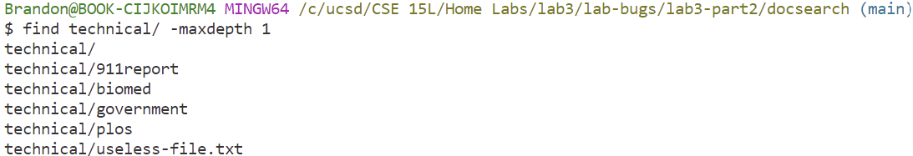
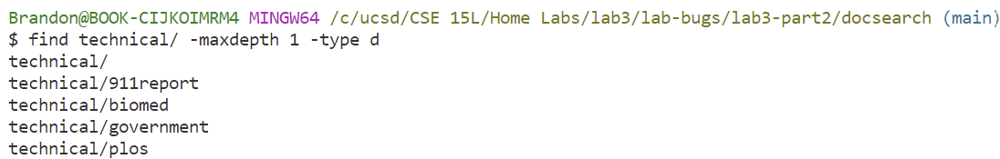
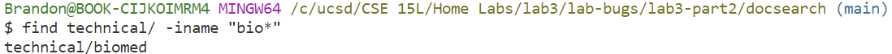
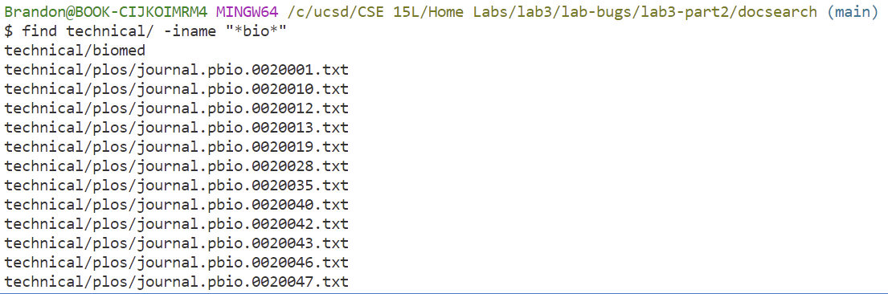
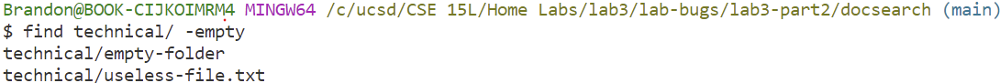
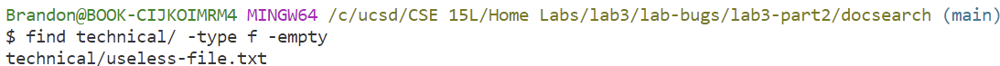

Brandon Panuco<br>
Lab 3 correction<br>

Part 1<br><br>
a) I chose to debug the ```filter(List<String> list, StringChecker sc)``` method in ```ListExamples.java``` file. I started by creating a file called ```ListTests.java``` where I created a ```testList()``` method. The ```testList``` method initialized an 
arrayList named ```input1``` and another one called ```expected```. ```input1``` arrayList is the object I used to compare to the correct outcome, which I saved inside the ```expected``` object.
I then used ```assertEquals(expected, ListExamples.filter(input1,new StringChecker(){...})``` on both objects. As for the ```StringChecker``` interface, to begin testing without fixing any code errors, I decided to implement the `checkString(String s)` method inside 
the second ```filter``` method argument, so it can be passed into the ```filter``` method. My ```checkString``` implemented method says that if a string's length is larger than 1, then it should
not be included in the new ArrayList. My ```input1``` object contains 4 Strings: ```["aaa","b","ccc","a"]```. According to the rule described for the ```filter``` method, ```["b","a"]``` should be the
new Strings saved into a new ArrayList. Hence, I initialized the ```expected``` arrayList with  ```["b","a"]```.<br>
Here is the unbugged code for the ```ListTests.java``` file (```ListExamples.java``` remains unchanged):<br>
```
 public class ListTests {
    @Test 
    public void testList() {

        List <String> input1 = new ArrayList<>();
        input1.add("aaaa");
        input1.add("b");
        input1.add("ccc");
        input1.add("a");
        List <String> expected = Arrays.asList("b","a");
        assertEquals(expected, ListExamples.filter(input1,new StringChecker() {
            @Override
            public boolean checkString(String s) {
                if (s.length() > 1)
                    return false;
                return true;
            }  
        }
        ));

    }

}
```
<br>
b) I decided to remove String `a` from the `input1` ArrayList in order to purposely make the program believe that the `filter` method works as intended. By removing String 
`a`, String `b` remains as the only element with String length 1, so the order rule in the `filter` method does not apply here.<br>
Here is the unbugged code that does not produce a failure (`ListExamples.java` remains unchanged):<br>
```
import static org.junit.Assert.*;
import org.junit.*;

import java.util.ArrayList;
import java.util.Arrays;
import java.util.List;

public class ListTests {
    @Test 
    public void testList() {

        List <String> input1 = new ArrayList<>();
        input1.add("aaaa");
        input1.add("b");
        input1.add("ccc");
        //input1.add("a");
        List <String> expected = Arrays.asList("b");
        assertEquals(expected, ListExamples.filter(input1,new StringChecker() {
            @Override
            public boolean checkString(String s) {
                if (s.length() > 1)
                    return false;
                return true;
            }  
        }
        ));

    }

}	
```
<br>
c) In order to fix the bug, I had to change the way in which Strings were being added into the result ArrayList inside the `filter` method. The code in `filter` basically followed
the rules given by the `StringChecker` interface. An if statement inside the `filter` method determines whether a String is valid to get added into the result ArrayList. The 
bug being the line: ```result.add(0,s); ```. This line makes is so that Strings get added in the reversed order from their original ArrayList. The reason why this occurs is
because when a new item is added at index 0, the items shift to the riggt since index 0 has been occupied by a new String. To fix the bug, removing the first argument from the
`add` method will make it so that incoming Strings get added at the end of the ArrayList as expected. Here is the correction: ```result.add(s); ``` .<br>
Here is the bugged version:<br>
```
import java.util.ArrayList;
import java.util.List;

interface StringChecker { boolean checkString(String s); }

class ListExamples {

  // Returns a new list that has all the elements of the input list for which
  // the StringChecker returns true, and not the elements that return false, in
  // the same order they appeared in the input list;
  static List<String> filter(List<String> list, StringChecker sc) {
    List<String> result = new ArrayList<>();
    for(String s: list) {
      if(sc.checkString(s)) {
        result.add(0,s);
      }
    }
    return result;
  }
}
```
Here is the unbugged version:<br>
```
import java.util.ArrayList;
import java.util.List;

interface StringChecker { boolean checkString(String s); }

class ListExamples {

  // Returns a new list that has all the elements of the input list for which
  // the StringChecker returns true, and not the elements that return false, in
  // the same order they appeared in the input list;
  static List<String> filter(List<String> list, StringChecker sc) {
    List<String> result = new ArrayList<>();
    for(String s: list) {
      if(sc.checkString(s)) {
        result.add(s);
      }
    }
    return result;
  }
}
```
Here is the `ListTests` class code:<br>
```
import static org.junit.Assert.*;
import org.junit.*;

import java.util.ArrayList;
import java.util.Arrays;
import java.util.List;

public class ListTests {
    @Test 
    public void testList() {

        List <String> input1 = new ArrayList<>();
        input1.add("aaaa");
        input1.add("b");
        input1.add("ccc");
        input1.add("a");
        List <String> expected = Arrays.asList("b","a");
        assertEquals(expected, ListExamples.filter(input1,new StringChecker() {
            @Override
            public boolean checkString(String s) {
                if (s.length() > 1)
                    return false;
                return true;
            }  
        }
        ));

     }

}

```
<br>Part 2<br><br>
citation: <a href="https://www.redhat.com/sysadmin/linux-find-command">https://www.redhat.com/sysadmin/linux-find-command</a>
<br><br>
`find -type d`<br>
<br> The `-type d` option allows users to display only the directories of the provided path.<br><br>
`find technical/ -type d`
<br>Here I chose to display all directories found inside the `technical/` path. This is useful because if a user is only interested in a specific set of files, displaying all
file path locations is problematic since it makes the search process tedious.<br>
<br>
`find technical/government -type d`
<br>Here I chose to display all directories inside the `government/` folder that is found inside the `technical` path. This is helpful once a user has found a specific folder
they want to investigate, so they can search even more deep. In this case, a user may be interested in a specific `goverment` file, so this command directly accesses all 
folder contents of `government`.<br>
<br><br>

`find -maxdepth`<br>
<br> The -maxdepth option filters the amount searches for the path provided.<br><br>
`find technical/ -maxdepth 1`
<br> For this case, it has a similar functionallity to the `-type d` option in the way that it will display a maximum of only 1 file or directory. This is useful in case a user wants to find out how many different directories and files are there for the specific path without going deeper than 1 file/directory.<br>
<br>
`find technical/ -maxdepth 1 -type d`
<br> In this case, adding the `-type d` option allows to diplay all directories within a specific depth search. For instance, this example shows how many directories there are
in the `technical/` folder without going deeper than 1. This will help users navigate way quickly as it eliminates directory replicas such as when only using `-type d` by itself.<br>
<br><br>

`find -iname` <br>
<br>This option allows to search our directory at the specific path with specific keyword case-insensitive.<br><br>
`find technical/ -iname "bio*"`
<br> Useful since whenever a user has an idea of what folder or file to search, if that path starts exatly with a given keyword, in this case `"bio"`, the user can use this command with string `"bio*"` as argument. The search resulted in the `biomed` path. <br>
<br>
`find technical/ -iname "*bio*"`
<br> If the user wants to find a file or directory with a keyword in mind, they can use the provided command with string argument `"*<string>*"` in case the file/directory does not start or end with that specific keyword. It is useful as it will display desired text files and eliminate useless options in relation to the user's search.<br>
<br><br>

`find -empty`<br>
<br> locates and finds all empty files/directories.<br><br>

`find technical/ -empty`
<br> This specific empty command allows for searches on files and directories that are empty. It is helpful when there is way too many files and directories, and users want to trash the empty ones without having to search manually. <br>
<br>
`find technical/ -empty -type f`
<br>If the users decides to add the `-type` option, then the command will locate and find all empty items in relation to that type. In this case I chose empty files, which may be useful if it is important to keep folders empty.<br>
<br>

