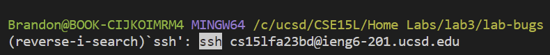
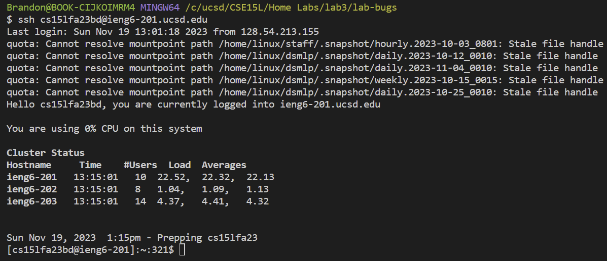
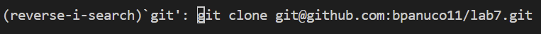
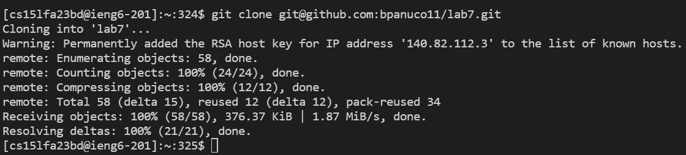
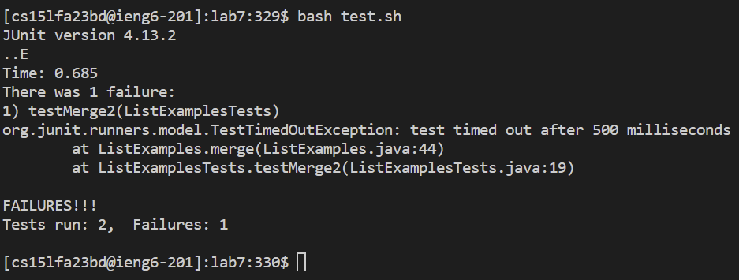
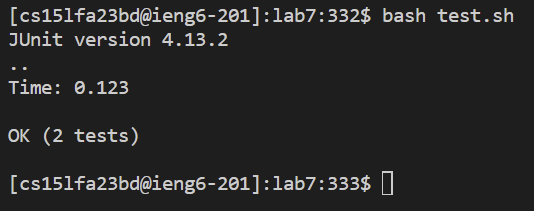
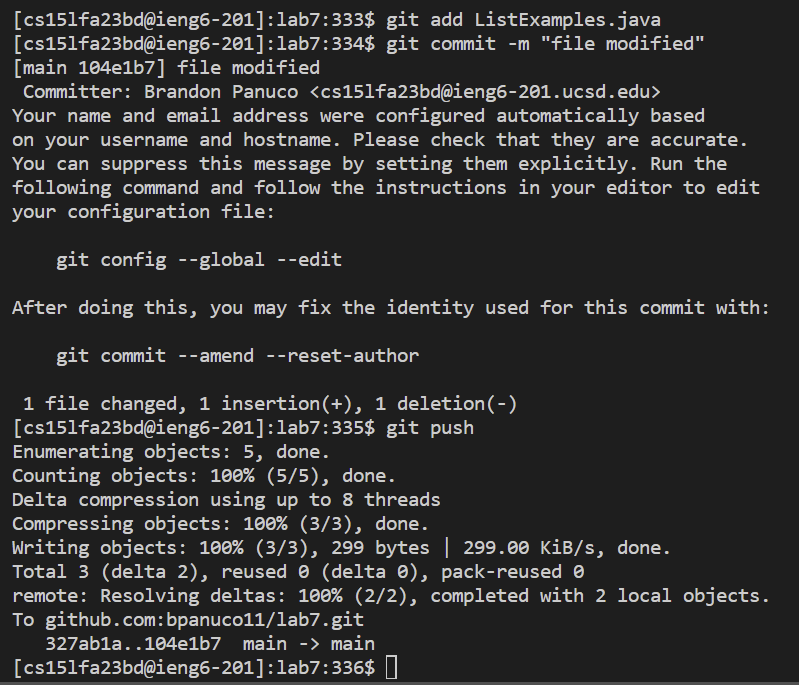

Brandon Panuco  
Lab 4  

Log into `ieng6`  

To log into `ieng6` instead of typing my full username as an argument to `ssh`: `ssh cs15lfa23__@ieng6-201.ucsd.edu`, I used `Ctr-R` to reverse search for my long username considering that I am aware that I have typed it many times prior, so it should be in my bash history. I then press `<enter>` to confirm that the reverse ssearch command has found my desired command. One thing that I learned from the `<enter>` key while using `Ctr-R` is that the `<enter>` key will confirm and run the command found by the reverse search.
 

`<Ctr><R>`,`ssh` 
  

`<enter>`  
  

Cloning the Lab 7 fork using `SSH` URL   

In order to clone the Lab 7 fork I used `Ctr-R`, but now instead of searching with keyword `ssh` I used `git` as my keyword. I was then shown my desired command: `git clone git@github.com:bpanuco11/lab7.git`, so I pressed the `<enter>` keyword to run the command and begin clonning the lab 7 fork. 

`<Ctr><R>`,`git` 
  

`<enter>`  
  

Running tests to show they fail  
After I was done clonning the lab 7 fork I wanted to make sure the clone was successful, so I used `ls` with character `l` and pressed `<tab>` in order to get a shortcut to the command: `ls lab7/`. I then pressed `<enter>` to run the command, so I could confirm if the clone worked. After confirming, I wanted to change directories into the lab 7 folder, so I did exactly the same steps, but instead of `ls` I used `cd`. After I changed directories into the lab 7 folder, I wanted to run `bash test.sh`, so in order to do it the quick way I typed `bash` followed by the character `t`. I then pressed `<tab>`, which immediately provided me with the command `bash test.sh` since there are no other `sh` files starting with character `t`. After getting my desired command I pressed `<enter>` to run the tests. 

`ls`,`l`,`<tab>`,`<enter>`  
`cd`,`l`,`<tab>`,`<enter>`  
`bash`,`t`,`<tab>`,`<enter>`  
  

Edit code file to fix error  

After running the tests, I figured that `ListExamples.java` produces an error specifically the merge method, so that meant that I had to modify the code in `ListExamples.java` by utilizing `vim`. To do that I typed `vim` followed by the word `List` and then pressed `<tab>`, which gave me the shortcut to `vim ListExamples`, so I added the dot character `.` and pressed `<tab>` once again. This gave me the desired shortcut to `vim ListExamples.java`, so I pressed `<enter>` to run the command. The reason why I had to use `<tab>` twice was because there exists another file that contains the keyword `ListExamples`, so `<tab>` returned `ListExamples` keyword. Once I ran the vim command and knew where the error is (from previous fixes), I used `<shift>` with `g` to go at the end of the file since the error was close to end. I then pressed the `<up>` arrow six times and now that I was at the line where the error was located I used `<shift>` with `$` to go at the end of the line, which allowed me to use the `<left>` arrow key 5 times. Now that my cursor was at the desired position I went into insert mode by pressing `i`, replaced the character `1` into `2`, and pressed `<esc>` to go back into normal mode. Once in normal mode I entered `:wq` followed by `<enter>` to save my changes. 

`vim`,`List`,`<tab>`,`.`,`<tab>`,`<enter>` 
`<shift><G>`,`<up><up><up><up><up><up>`,`<shift><$>`,`<left><left><left><left><left>` 
`i`,(corrections),`<esc>`,`:wq <enter>` 
  

Running tests to show they succeed  

To check if my changed fixed the code I entered the keyword `bash` followed by character `t` and pressed `<tab>`. This gave me the `bash test.sh` shortcut, so I proceeded by pressing `<enter>`. After running the bash script, the output showed that my changes fixed the code error. 

`bash`,`t`,`<tab>`,`<enter>`  
  

Commit and push changes  

I first ran the command `git add` and pressed `<tab>`, which automatically filled the file that I modified: `ListExamples.java`. I pressed `<enter>` and then ran the command `git commit -m "file modified"`. The `git commit` command requires a message, so I passed in `file modified` as the message. After pressing `<enter>` I ran `git push` to push my changes into my github account and pressed `<enter>`. 

`git add`, `<tab>`, `<enter>`  
`git commit -m "file modified"`, `<enter>`  
`git push`, `<enter>` 

