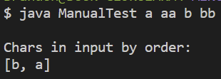
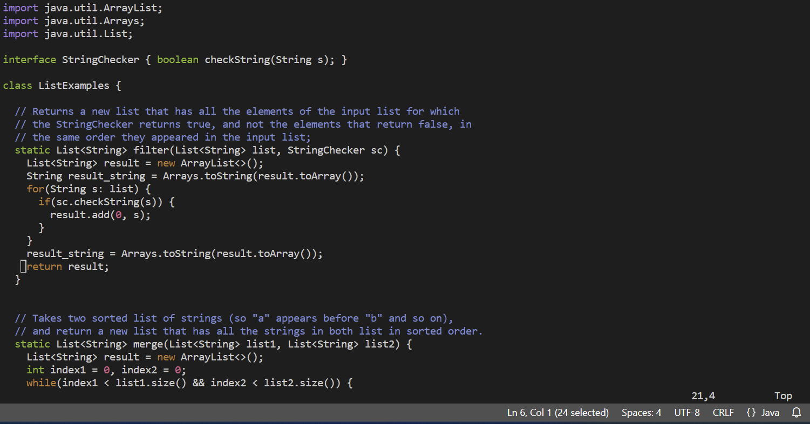
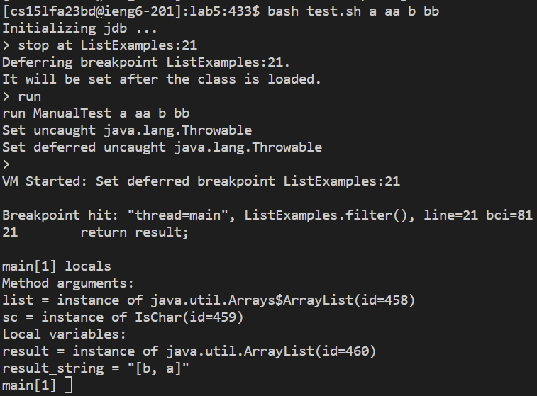
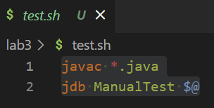
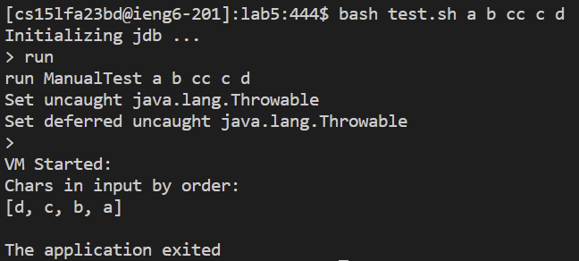
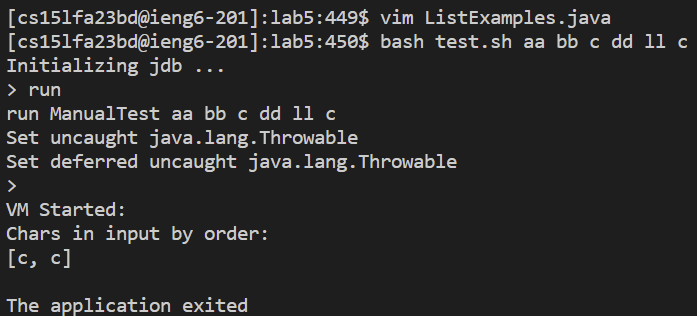
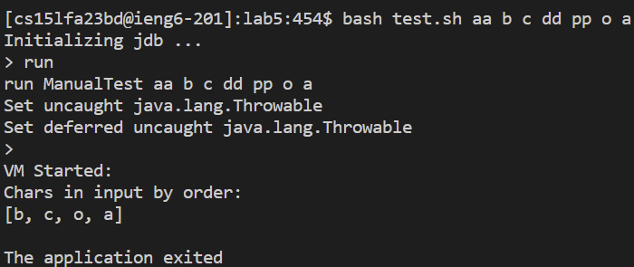

Brandon Panuco<br>
Lab 5<br><br>

Part 1<br><br>

1.<br>
Hello, how are you? I was wondering if you could help me with my Project 1 code since it does not seem to be working as intended. I basically used the `filter` method shown in lecture and implemented the `checkString(String s)` method found in the `StringChecker` interface, so that any input in the terminal returns a `List` of `Char` type in the order they are present in input. For example if the input is `a fg c dd o`, then the output should be `[a,c,o]`. The issue being that although my program correctly collects all `Char` type present, it does not collect them in the order they are present by the input. <br>
<br>
Here the `symptom` being that the program prints `[b,a]`, which should be `[a,b]`. The `failure-inducing input` being `a aa b bb`. Maybe the bug is that when I use `Arrays.toString(result.toArray()))` to print in `System.out.println()` it somehow reorders in reverse order before converting into a `String`? Any help is appreciated, thank you.<br><br>
2. 
Hi there. It is important you understand what is happening line by line in your code. Have you considered using `jdb` to try and understand the behavior of your code line by line? Try using in a `bash script`, so you only have to run the `sh` file with your `failure-inducing input` as arguments (`$@`). HINT: I suggest using `Arrays.toString(result.toArray()))` to your favor while usinf `jdb` so you can keep track of what is occuring to your `result` variable specifically inside your `filer` method. Make sure while using `jdb` you use `stop at <Class_Name>:<Line>` and `locals` commands to try and figure out where your bug is and what must be done to fix it.<br><br>
3. 
Hi Again. So I tried `jdb` in a `bash script` called `test.sh`, but before that I made sure to add necessary code: `import java.util.Arrays;` and `result_string = Arrays.toString(result.toArray()));` into the `ListExamples.java` file. I then found exactly where I wanted to set a `breakpoint`, so that I did not exit out of my `filer` method. Based on my results, it seems that the bug is the line of code `result.add(0, s);` since it seems that after the for loop is done executing that line of code, `result_string` contains the `symptom`. That means that the bug is not found after I envoked the `filter` method, but inside it. Below I provide my changes to the `ListExamples.java` file and `jdb` results: <br>
<br>
<br><br>
4.
Nice job. Now that you found the `bug` I will guide you into fixing it. <br>
Code before bug fix (`ManualTest.java`):<br>
```
import java.util.ArrayList;
import java.util.Arrays;
import java.util.List;
class IsChar implements StringChecker{
    @Override
    public boolean checkString(String s) {
        if (s.length() == 1)
            return true;
        return false;
    }
}
public class ManualTest {
    public static void main(String[] args) {
        List <String> input = Arrays.asList(args);
        List <String> result = ListExamples.filter(input,new IsChar());
        System.out.println("\nChars in input by order:\n" + 
        Arrays.toString(result.toArray()));
    }
}
```
Code before bug fix (`ListExamples.java`):<br>
```
import java.util.ArrayList;
import java.util.Arrays;
import java.util.List;
interface StringChecker { boolean checkString(String s); }
class ListExamples {
  // Returns a new list that has all the elements of the input list for which
  // the StringChecker returns true, and not the elements that return false, in
  // the same order they appeared in the input list;
  static List<String> filter(List<String> list, StringChecker sc) {
    List<String> result = new ArrayList<>();
    String result_string = Arrays.toString(result.toArray());
    for(String s: list) {
      if(sc.checkString(s)) {
        result.add(0, s);
      }
    }
    result_string = Arrays.toString(result.toArray());
    return result;
  }
}

```

Since we want to automatically set up `jdb` and pass all inputs as arguments we start by creating a `bash script` named `test.sh`. The bash script will first compile all java files and in the next line we will run the `jdb` command with `ManualTest` as the `class`, since that is the name of you are using for your class, and finally we will use `$@` to pass all arguments as an array into the script. Make sure the `test.sh` file is located in the same directory as all other used java files, since we are not providing the complete path while compilying and running `jdb`.<br>
<br>
Now I will run a `failure-inducing input` that will provoke the bug to occur: `bash test.sh a b cc c d`. This command line will return the `symptom` `[d,c,b,a]`, which is wrong since we expect `[a,b,c,d]`.<br>
<br>
If I repeat the steps but instead of passing `a b cc c d` as the arguments and instead pass `aa bb c ll c` I get `[c,c]`, which is actually wrong. Here the bug is still present, but it is impossible to notice it from the `symptom` since we get exactly two `c` characters that get added into the list. <br>
<br>
Lastly, since we have found the `bug`, which is the line `result.add(0, s);` all we have to do is change it so that instead of adding at `index 0` it adds to the end of the `List`. That means that our bug was originally adding new `elements` at the start, so it pushed old elements to the right one spot, which is not what is wanted. The fixed line of code is: `result.add(s);`. Below I will try running the `bash script` once again with `aa b c dd pp o a` as arguments to see if it correctly displays what we expect: `[b,c,o,a]`.<br>
<br>
Since the output is the same as the expected output, we have successfully fixed the `bug`.<br><br>

Part 2. <br><br>
The first half of the quarter I felt like I was not learning anything useful since command lines by themselves felt like they all were useful only for opening and reading files. After the second half I learned way more useful things especifally the tool `vim`. I feel like `vim` is one of the most important concepts in this course since it allows me to quickly modify files if I have issues accessing the UI or if I am stuck in a terminal such as when loggin into `ssh`. Overall aside from `vim`, I feel like this course taught me useful skills that I wil actually be using in the future. 
